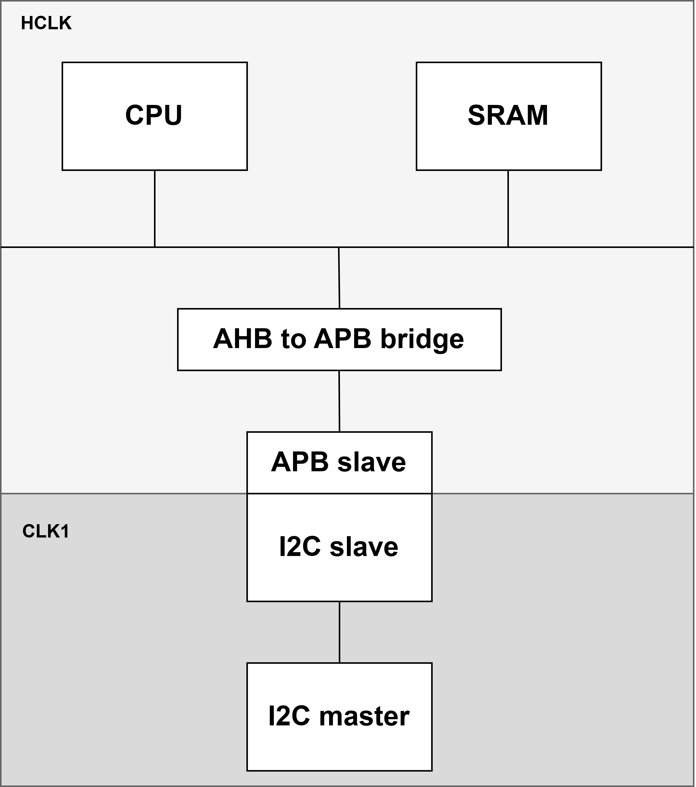
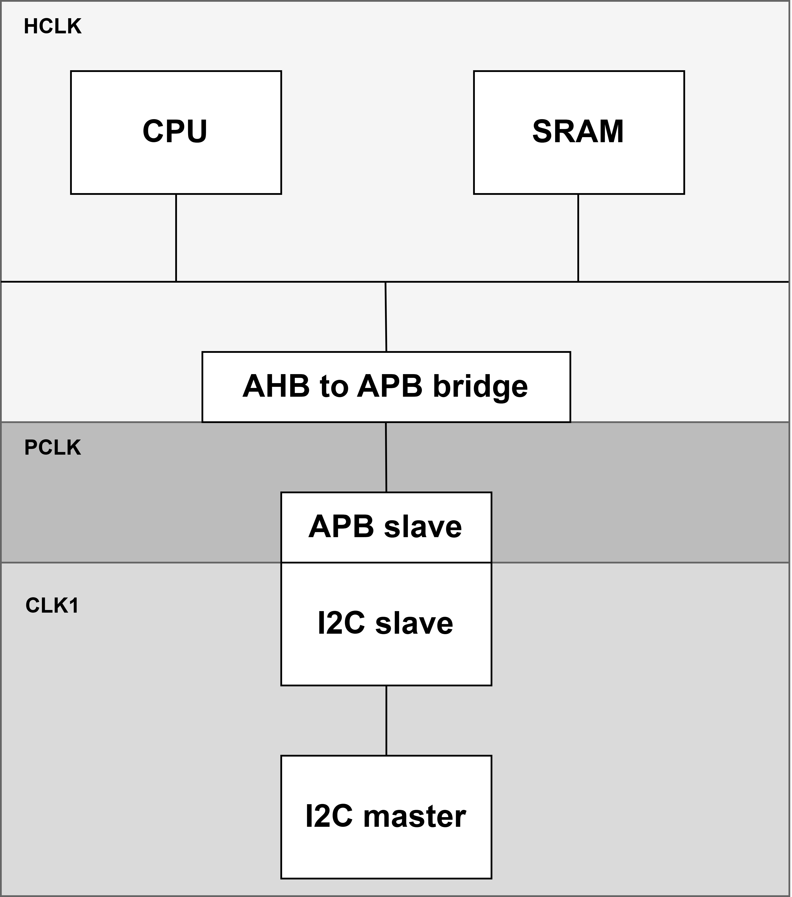

# cpu
---
🔴  **Before CPU integration, the master and RF modules were first designed and verified in Verilog. They were then implemented in firmware and integrated with the actual CPU.**

*) use ARM cortex m0 (Design Start)

*)The pass/fail result of the write display in `tb_apb.v` depends on the configured frequency (speed) and FIFO depth. 
Therefore, it should be adjusted accordingly or verified through waveform analysis.

- **No depth ctrl (without FIFO management)**
  : has two clock
    

  

  - **HW** :Developed based on the previously implemented APB master–connected I2C APB module [i2c_apb](https://github.com/ddddddddggod/APB/tree/main) with added MMIO registers and protocol compliance.
  - **CPU** : Updated the design by replacing the `apb_master` and `pkt_ctrl` with **CPU firmware**, and substituting the `rf` with **SRAM**.
  
- **No depth ctrl_CDC (without FIFO management)**
  : has three clock
      

  

  
- **DepthCtrl (fifo management)**
  - **RX** : Implements FIFO management for the RX path only.
  - **Fin** : Implements FIFO management for both RX and TX paths, with additional CDC (Clock Domain Crossing) modularization.
 

